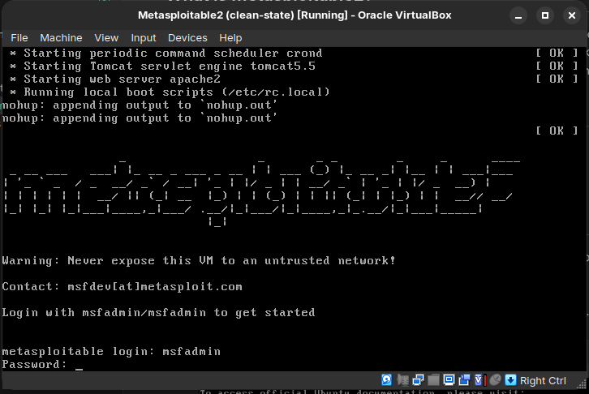
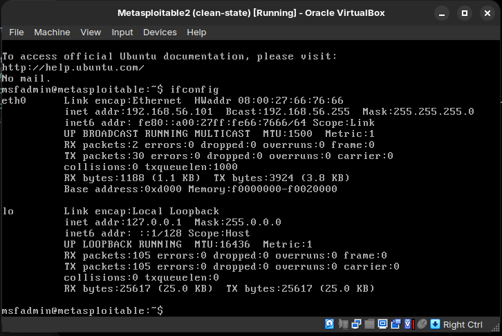

Testing Nmap on Metasploitable2

## What is Metasploitable2?

Metasploitable2 is an intentionally vulnerable Linux virtual machine used for security training and safe hands-on practice. It is designed to expose many common services with known weaknesses so you can learn reconnaissance, enumeration, and exploitation in a controlled lab.

## Installation guide (video)

Use this guide to install Metasploitable2 in your lab environment:

- https://youtu.be/l8v65ePR44k?si=8Pv8esRiKj7kPCPO


## Target and lab context
- After a succesfull metasploitable2 installation fire it up from the virtual box and,you should login with credentials username:msfadmin and password:msfadmin


- Then run `ifconfig` to see the ip-address of your metasploitable2 machine.mine is 192.168.56.101


- Target IP: 192.168.56.101

Reminder: The scans below are only a portion of the basic Nmap options.There are many more flags and combinations to explore.

## 1) TCP connect scan: `-sT`

### Command

```bash
nmap -sT 192.168.56.101
```

### What the flag does

`-sT` uses the operating system's normal TCP connect() calls to complete the full 3-way handshake. This is the most compatible scan type and does not require raw socket privileges.

### Advantages

- Works without root privileges(no neef to run it with sudo).
- Most reliable when raw packets are blocked.
- Easy to trace in packet captures for learning.

### Disadvantages

- More likely to be logged by the target because full connections are completed(it's easily detectable the system admin will know you are scanning their network).
- Usually slower than `-sS` on larger scans.

### Output (terminal)

```text
Starting Nmap 7.94SVN ( https://nmap.org ) at 2026-05-30 18:31 EAT
Nmap scan report for 192.168.56.101
Host is up (0.00087s latency).
Not shown: 977 closed tcp ports (conn-refused)
PORT     STATE SERVICE
21/tcp   open  ftp
22/tcp   open  ssh
23/tcp   open  telnet
25/tcp   open  smtp
53/tcp   open  domain
80/tcp   open  http
111/tcp  open  rpcbind
139/tcp  open  netbios-ssn
445/tcp  open  microsoft-ds
512/tcp  open  exec
513/tcp  open  login
514/tcp  open  shell
1099/tcp open  rmiregistry
1524/tcp open  ingreslock
2049/tcp open  nfs
2121/tcp open  ccproxy-ftp
3306/tcp open  mysql
5432/tcp open  postgresql
5900/tcp open  vnc
6000/tcp open  X11
6667/tcp open  irc
8009/tcp open  ajp13
8180/tcp open  unknown

Nmap done: 1 IP address (1 host up) scanned in 0.27 seconds
```

### Meaning of the output

- Nmap found 23 TCP ports open and most others closed.
- Each open port corresponds to a service that can be enumerated further.
- The service names are the default port-to-service mappings, not confirmed versions.

## 2) Service/version detection: `-sV`

### Command

```bash
nmap -sV 192.168.56.101
```

### What the flag does

`-sV` probes open ports to identify the service and its version by analyzing banner responses and protocol behavior.

### Advantages

- Reveals exact service versions to map to known vulnerabilities.
- Improves accuracy beyond default port names.

### Disadvantages

- Slower and noisier than a basic scan.
- Some services may block or mislead version probes.

### Output (terminal)

```text
Starting Nmap 7.94SVN ( https://nmap.org ) at 2026-05-30 18:32 EAT
Nmap scan report for 192.168.56.101
Host is up (0.00028s latency).
Not shown: 977 closed tcp ports (conn-refused)
PORT     STATE SERVICE     VERSION
21/tcp   open  ftp         vsftpd 2.3.4
22/tcp   open  ssh         OpenSSH 4.7p1 Debian 8ubuntu1 (protocol 2.0)
23/tcp   open  telnet      Linux telnetd
25/tcp   open  smtp        Postfix smtpd
53/tcp   open  domain      ISC BIND 9.4.2
80/tcp   open  http        Apache httpd 2.2.8 ((Ubuntu) DAV/2)
111/tcp  open  rpcbind     2 (RPC #100000)
139/tcp  open  netbios-ssn Samba smbd 3.X - 4.X (workgroup: WORKGROUP)
445/tcp  open  netbios-ssn Samba smbd 3.X - 4.X (workgroup: WORKGROUP)
512/tcp  open  exec        netkit-rsh rexecd
513/tcp  open  login
514/tcp  open  shell       Netkit rshd
1099/tcp open  java-rmi    GNU Classpath grmiregistry
1524/tcp open  bindshell   Metasploitable root shell
2049/tcp open  nfs         2-4 (RPC #100003)
2121/tcp open  ftp         ProFTPD 1.3.1
3306/tcp open  mysql       MySQL 5.0.51a-3ubuntu5
5432/tcp open  postgresql  PostgreSQL DB 8.3.0 - 8.3.7
5900/tcp open  vnc         VNC (protocol 3.3)
6000/tcp open  X11         (access denied)
6667/tcp open  irc         UnrealIRCd
8009/tcp open  ajp13       Apache Jserv (Protocol v1.3)
8180/tcp open  http        Apache Tomcat/Coyote JSP engine 1.1
Service Info: Hosts:  metasploitable.localdomain, irc.Metasploitable.LAN; OSs: Unix, Linux; CPE: cpe:/o:linux:linux_kernel

Service detection performed. Please report any incorrect results at https://nmap.org/submit/ .
Nmap done: 1 IP address (1 host up) scanned in 11.67 seconds
```

### Meaning of the output

- Exact service versions appear in the `VERSION` column; these are key for vulnerability research.
- Example: `vsftpd 2.3.4` is a known vulnerable version in training labs.
- `Service Info` summarizes OS hints and hostnames discovered during probing.

## 3) OS detection: `-O`

### Command

```bash
sudo nmap -O 192.168.56.101
```

### What the flag does

`-O` uses TCP/IP stack fingerprinting to guess the operating system. It requires raw packet privileges, so `sudo` is needed.

### Advantages

- Gives a high-level OS and kernel range to focus enumeration.
- Useful for selecting OS-specific exploits or checks.

### Disadvantages

- Requires root privileges(you need to run it with sudo).
- Fingerprinting can be inaccurate on filtered or hardened targets.

### Output (terminal)

```text
Starting Nmap 7.94SVN ( https://nmap.org ) at 2026-05-30 18:33 EAT
Nmap scan report for 192.168.56.101
Host is up (0.00099s latency).
Not shown: 977 closed tcp ports (reset)
PORT     STATE SERVICE
21/tcp   open  ftp
22/tcp   open  ssh
23/tcp   open  telnet
25/tcp   open  smtp
53/tcp   open  domain
80/tcp   open  http
111/tcp  open  rpcbind
139/tcp  open  netbios-ssn
445/tcp  open  microsoft-ds
512/tcp  open  exec
513/tcp  open  login
514/tcp  open  shell
1099/tcp open  rmiregistry
1524/tcp open  ingreslock
2049/tcp open  nfs
2121/tcp open  ccproxy-ftp
3306/tcp open  mysql
5432/tcp open  postgresql
5900/tcp open  vnc
6000/tcp open  X11
6667/tcp open  irc
8009/tcp open  ajp13
8180/tcp open  unknown
MAC Address: 08:00:27:66:76:66 (Oracle VirtualBox virtual NIC)
Device type: general purpose
Running: Linux 2.6.X
OS CPE: cpe:/o:linux:linux_kernel:2.6
OS details: Linux 2.6.9 - 2.6.33
Network Distance: 1 hop

OS detection performed. Please report any incorrect results at https://nmap.org/submit/ .
Nmap done: 1 IP address (1 host up) scanned in 1.59 seconds
```

### Meaning of the output

- Nmap estimates a Linux 2.6 kernel range, consistent with Metasploitable2.
- `Network Distance: 1 hop` confirms this is a local lab host.

### All of the above are easily detectable and the system admin will know you are scanning their network.To solve this problem,we use the `-sS` flag.


## 4) TCP SYN scan: `-sS` (stealth scan)

### Command

```bash
sudo nmap -sS 192.168.56.101
```

### What the flag does

`-sS` sends SYN packets and analyzes responses without completing the full TCP handshake. It is often called a "half-open" scan and requires raw packet privileges.

### Advantages

- Faster and less noisy than `-sT` on most networks.
- Often less logged by services because connections are not fully established.

### Disadvantages

- Requires root privileges.
- Some firewalls and IDS/IPS can still detect SYN scans.

### Output (terminal)

```text
Starting Nmap 7.94SVN ( https://nmap.org ) at 2026-05-30 18:33 EAT
Nmap scan report for 192.168.56.101
Host is up (0.00014s latency).
Not shown: 977 closed tcp ports (reset)
PORT     STATE SERVICE
21/tcp   open  ftp
22/tcp   open  ssh
23/tcp   open  telnet
25/tcp   open  smtp
53/tcp   open  domain
80/tcp   open  http
111/tcp  open  rpcbind
139/tcp  open  netbios-ssn
445/tcp  open  microsoft-ds
512/tcp  open  exec
513/tcp  open  login
514/tcp  open  shell
1099/tcp open  rmiregistry
1524/tcp open  ingreslock
2049/tcp open  nfs
2121/tcp open  ccproxy-ftp
3306/tcp open  mysql
5432/tcp open  postgresql
5900/tcp open  vnc
6000/tcp open  X11
6667/tcp open  irc
8009/tcp open  ajp13
8180/tcp open  unknown
MAC Address: 08:00:27:66:76:66 (Oracle VirtualBox virtual NIC)

Nmap done: 1 IP address (1 host up) scanned in 0.24 seconds
```

### Meaning of the output

- The same ports are open as in `-sT`, but the scan completed slightly faster.
- SYN scans are a standard baseline for TCP discovery.

## 5) TCP SYN scan with polite timing: `-sS -T2`(To evade intrusion detection systems)

### Command

```bash
sudo nmap -sS -T2 192.168.56.101
```

### What the flag does

`-T2` lowers timing aggressiveness. This reduces scan speed and noise, which can help avoid rate limits or IDS triggers.

### Advantages

- Less likely to overwhelm the target or trigger rate-based alerts.
- Useful on unstable networks or older devices.

### Disadvantages

- Significantly slower than default timing.
- Long scans are easier to notice in time-based logs.

### Output (your lab)

```text
Starting Nmap 7.94SVN ( https://nmap.org ) at 2026-05-30 23:28 EAT
Nmap scan report for 192.168.56.101
Host is up (0.0012s latency).
Not shown: 977 closed tcp ports (reset)
PORT     STATE SERVICE
21/tcp   open  ftp
22/tcp   open  ssh
23/tcp   open  telnet
25/tcp   open  smtp
53/tcp   open  domain
80/tcp   open  http
111/tcp  open  rpcbind
139/tcp  open  netbios-ssn
445/tcp  open  microsoft-ds
512/tcp  open  exec
513/tcp  open  login
514/tcp  open  shell
1099/tcp open  rmiregistry
1524/tcp open  ingreslock
2049/tcp open  nfs
2121/tcp open  ccproxy-ftp
3306/tcp open  mysql
5432/tcp open  postgresql
5900/tcp open  vnc
6000/tcp open  X11
6667/tcp open  irc
8009/tcp open  ajp13
8180/tcp open  unknown
MAC Address: 08:00:27:66:76:66 (Oracle VirtualBox virtual NIC)

Nmap done: 1 IP address (1 host up) scanned in 401.57 seconds
```


________________
   <by`Atomic`>
 ----------------
        \   ^__^
         \  (oo)\_______
            (__)\       )\/\
                ||----w |
                ||     ||
                                                 
                                                                