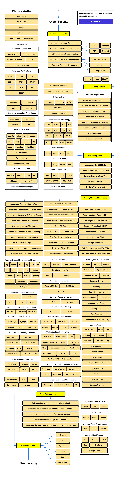

# Grey Hat Roadmap

<p align="center">
	
</p>

<p align="center">
	<strong>Building a practical, evolving security learning path.</strong>
</p>

<p align="center">
	<a href="#overview">Overview</a> •
	<a href="#roadmap">Roadmap</a> •
	<a href="#focus-areas">Focus Areas</a> •
	<a href="#important-note">Important Note</a>
</p>

---

## Overview

This repository tracks my  **Grey Hat Roadmap**, including resources, notes, and progressively refined learning paths.

The goal is to keep this roadmap practical, skill-driven, and updated.

---

## Roadmap

### Main Roadmap 

Roadmap preview:

<p align="center">
	<a href="assets/cyber-security.pdf">
		
	</a>
</p>

> Click the image to open the full PDF version.

---

## Focus Areas

```text
[ RECON ] -> [ WEB / API TESTING ] -> [ NETWORKING ] -> [ REPORTING ] -> [ AUTOMATION ]
```

- Recon and attack surface mapping
- Web and API vulnerability fundamentals
- Networking foundations for offensive testing
- Writing clear and reproducible findings
- Tooling and workflow automation

---

## Important Note

This roadmap is **based on content from roadmap.sh**.

I will modify and adapt it in the way I find most convenient.

Reference source:

- [https://roadmap.sh](https://roadmap.sh)

---


## License

This repository is for educational and personal roadmap organization purposes.
